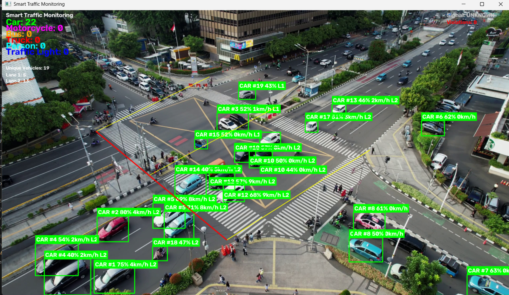

# 🚦 AI-Powered Smart Traffic Monitoring System

> **An end-to-end computer vision pipeline for traffic-scene understanding, vehicle analytics, traffic-light recognition, lane analysis, speed estimation, license-plate recognition, and traffic-violation detection from prerecorded road footage.**


---

## 🎥 Demo / Output

<p align="center">
  
</p>

The system processes prerecorded road footage and generates annotated traffic-analysis output containing object detections, tracking information, traffic-light state, lane information, vehicle speed, license-plate results, and detected traffic violations.

---

# 📌 Overview

The **AI-Powered Smart Traffic Monitoring System** is a modular computer vision pipeline designed to analyze prerecorded traffic footage and extract structured information from road scenes.

The system combines object detection, tracking, image processing, OCR, geometric calibration, lane analysis, and traffic analytics into a single processing pipeline.

### Current capabilities

* 🚦 Traffic-light detection and state recognition
* 🚗 Vehicle detection and classification
* 🚶 Pedestrian detection
* 🔢 License-plate detection
* 📝 License-plate recognition using OCR
* 🎯 Multi-object tracking
* 🛣️ Lane detection and vehicle-lane association
* 📏 Vehicle speed estimation
* 🚨 Red-light violation detection
* 📊 Vehicle and pedestrian statistics
* 🎥 Annotated video generation

The project focuses on demonstrating how multiple computer-vision components can be integrated into one end-to-end traffic-analysis system.

---

# 🎯 Problem Statement

Traditional traffic monitoring often relies on manual observation or dedicated infrastructure.

A vision-based system can instead use existing road footage to automatically answer questions such as:

* How many vehicles are present?
* What types of vehicles are on the road?
* How many pedestrians are visible?
* What is the current traffic signal state?
* Which lane is a vehicle occupying?
* How fast are tracked vehicles moving?
* Can visible license plates be extracted?
* Did a vehicle cross a restricted area during a red signal?
* How does traffic behavior change throughout the video?

The goal of this project is to build a modular computer vision pipeline capable of extracting these observations automatically from traffic footage.

---

# 🧠 System Architecture

The current pipeline follows this general processing flow:

```text
                    Traffic Video
                         │
                         ▼
                Video / Frame I/O
                         │
                         ▼
                  YOLO Detection
                         │
          ┌──────────────┼──────────────┐
          │              │              │
          ▼              ▼              ▼
       Vehicles      Pedestrians    Traffic Light
          │                             │
          ▼                             ▼
       Tracking                  State Recognition
          │
     ┌────┼───────────────┐
     │    │               │
     ▼    ▼               ▼
   Lane  Speed        License Plate
 Analysis Estimation    Detection
     │    │               │
     │    │               ▼
     │    │             OCR
     │    │               │
     └────┴───────┬───────┘
                  │
                  ▼
          Traffic Analytics
                  │
                  ▼
       Violation Detection
                  │
                  ▼
          Annotated Output
```

---

# ⚙️ Core Pipeline

## 1. Video Input

The system accepts prerecorded traffic footage as input.

Each video is processed frame-by-frame using OpenCV.

```text
Input Video
     ↓
Frame Extraction
     ↓
Object Detection
     ↓
Tracking
     ↓
Scene Analysis
     ↓
Traffic Analytics
     ↓
Annotated Frame
     ↓
Output Video
```

Using prerecorded footage makes the system reproducible during development and allows different modules to be tested on the same traffic scenarios.

---

# 2. Object Detection

The primary object-detection stage uses **Ultralytics YOLO**.

The detector identifies traffic-relevant objects such as:

| Category          | Objects                     |
| ----------------- | --------------------------- |
| 🚗 Vehicles       | Car, Motorcycle, Bus, Truck |
| 🚶 People         | Pedestrian                  |
| 🚦 Infrastructure | Traffic Light               |

For each detection, the system obtains:

* Object class
* Confidence score
* Bounding-box coordinates

Conceptually:

```text
Frame
  │
  ▼
YOLO Detector
  │
  ├── Bounding Box
  ├── Class
  └── Confidence
```

These detections are then passed to the tracking and analytics modules.

---

# 🎯 3. Multi-Object Tracking

The tracking module assigns persistent IDs to detected objects across frames.

```text
Detection
    ↓
Object Tracking
    ↓
Persistent Object ID
    ↓
Trajectory
```

Tracking allows the system to distinguish between individual vehicles instead of treating every frame detection as a new vehicle.

This provides the foundation for:

* More reliable vehicle counting
* Vehicle trajectories
* Lane association
* Speed estimation
* Violation detection

---

# 🛣️ 4. Lane Detection and Analysis

The system includes lane-analysis functionality for identifying road-lane regions and associating tracked vehicles with lanes.

The lane-processing pipeline can be represented as:

```text
Traffic Frame
      ↓
Lane Detection
      ↓
Lane Regions
      ↓
Tracked Vehicle Position
      ↓
Vehicle-Lane Association
```

Lane information can then be used by downstream modules such as speed analysis and traffic-violation detection.

---

# 📐 5. Camera Calibration

Vehicle speed estimation requires converting image-space movement into a meaningful physical distance.

The project therefore includes a calibration module.

```text
Image Coordinates
       ↓
Scene Calibration
       ↓
Calibration Parameters
       ↓
World / Road Coordinates
```

The calibration process generates parameters stored in:

```text
src/calibration.json
```

These parameters are used by the speed-estimation pipeline to improve distance estimation from tracked vehicle movement.

---

# 📏 6. Vehicle Speed Estimation

The system estimates vehicle speed using tracked object movement and calibrated scene geometry.

Conceptually:

```text
Tracked Vehicle
      ↓
Position History
      ↓
Pixel Displacement
      ↓
Camera Calibration
      ↓
Physical Distance
      ↓
Time Difference
      ↓
Estimated Speed
```

The speed-estimation module uses vehicle trajectories rather than individual frame detections.

This allows speed to be calculated over a sequence of frames instead of attempting to estimate speed from a single image.

---

# 🚦 7. Traffic Light Recognition

Traffic-light processing is separated from general vehicle detection.

After identifying a traffic-light region, the system analyzes the corresponding region of interest to determine the active state.

```text
Traffic Light
      │
      ▼
Region of Interest
      │
      ▼
Image Processing
      │
      ├── 🔴 Red
      ├── 🟡 Yellow
      └── 🟢 Green
```

The detected signal state is then passed to the traffic-analysis and violation-detection modules.

---

# 🚨 8. Red-Light Violation Detection

The system includes a traffic-violation detection module that combines traffic-light state, vehicle tracking, and road-scene information.

A simplified representation is:

```text
Traffic Light State
        +
Vehicle Tracking
        +
Lane / Road Information
        +
Violation Region
        ↓
Red-Light Violation Detection
```

When the relevant conditions are satisfied, the system can flag a vehicle as a potential red-light violation.

This module demonstrates how individual computer-vision outputs can be combined into a higher-level traffic event.

---

# 🔢 9. License Plate Detection

License-plate processing is implemented as a two-stage pipeline.

### Stage 1 — Plate Detection

A license-plate detector identifies the plate region.

```text
Vehicle
   │
   ▼
License Plate Detector
   │
   ▼
Plate Bounding Box
```

### Stage 2 — OCR

The detected plate region is passed to the OCR pipeline.

```text
Plate Region
     │
     ▼
Preprocessing
     │
     ▼
EasyOCR
     │
     ▼
Recognized Text
```

Separating plate detection and OCR allows each stage to be improved independently.

---

# 🚶 10. Pedestrian Detection

Pedestrians are detected independently from vehicle traffic.

This allows the system to maintain separate statistics for:

* Vehicle traffic
* Pedestrian activity

The information can also support future extensions such as pedestrian-density analysis and road-safety analytics.

---

# 🚗 11. Vehicle Analytics

Detected vehicles are classified into categories such as:

* Car
* Motorcycle
* Bus
* Truck

The analytics module aggregates detections and tracking information to produce traffic statistics.

Example:

```text
Traffic Statistics

Cars          : 24
Motorcycles   : 11
Buses         : 3
Trucks        : 5
Pedestrians   : 8
```

Because tracking is incorporated into the pipeline, vehicle analytics can use persistent object identities rather than relying only on individual frame detections.

---

# 📊 12. Traffic Analytics

The analytics layer combines outputs from multiple modules.

Current metrics include:

* Vehicle counts
* Vehicle-class distribution
* Pedestrian counts
* Traffic-light state
* Lane information
* Vehicle speed
* Tracking information
* Detected traffic violations
* License-plate information

The analytics layer is separated from the detection layer so additional metrics can be incorporated without redesigning the entire pipeline.

---

# 🎥 Output Generation

After processing, the system generates annotated traffic-analysis output.

The visualization can contain:

```text
┌──────────────────────────────────────────────┐
│ 🚦 Traffic Light: GREEN                     │
│                                              │
│ Cars: 24   Bikes: 11   Bus: 3   Truck: 5   │
│ Pedestrians: 8                              │
│                                              │
│ Speed: 38 km/h                              │
│ Lane: 2                                     │
│                                              │
│ Vehicle ID: 17                              │
│                                              │
│ ⚠ Red-Light Violation                       │
│                                              │
│       ┌─────────────┐                        │
│       │     CAR     │                        │
│       │    0.91     │                        │
│       └─────────────┘                        │
│                                              │
└──────────────────────────────────────────────┘
```

The generated output is stored locally in the `output/` directory.

The repository keeps the representative output image for documentation, while generated video output can be excluded from Git tracking.

---

# 🏗️ Project Structure

```text
AI-Powered-Smart-Traffic-Monitoring/
│
├── models/
│   └── yolov8n.pt
│
├── output/
│   ├── image.png
│   └── output.mp4
│
├── src/
│   ├── analytics.py
│   ├── calibrate.py
│   ├── calibration.json
│   ├── detector.py
│   ├── lanes.py
│   ├── main.py
│   ├── ocr.py
│   ├── plate_detector.py
│   ├── speed_estimator.py
│   ├── tracker.py
│   ├── traffic_light.py
│   ├── utils.py
│   └── __pycache__/
│
├── videos/
│   ├── 14806068_2160_3840_32fps.mp4
│   ├── 18437773-uhd_3840_2160_50fps.mp4
│   ├── video1.mp4
│   └── video2.mp4
│
├── requirements.txt
└── README.md
```

### Module Responsibilities

| Module               | Responsibility                                          |
| -------------------- | ------------------------------------------------------- |
| `main.py`            | Main application entry point and pipeline orchestration |
| `detector.py`        | General object detection                                |
| `tracker.py`         | Multi-object tracking and persistent IDs                |
| `traffic_light.py`   | Traffic-light state recognition                         |
| `plate_detector.py`  | License-plate detection                                 |
| `ocr.py`             | License-plate text recognition                          |
| `lanes.py`           | Lane detection and vehicle-lane analysis                |
| `calibrate.py`       | Camera/scene calibration                                |
| `calibration.json`   | Stored calibration parameters                           |
| `speed_estimator.py` | Vehicle speed estimation                                |
| `analytics.py`       | Traffic statistics and event aggregation                |
| `utils.py`           | Supporting utility functions                            |
| `models/`            | Model weights                                           |
| `videos/`            | Input traffic footage                                   |
| `output/`            | Generated visual outputs                                |

> `__pycache__/` contains Python-generated cache files and should normally be excluded from version control.

---

# 🛠️ Technology Stack

### Python

Primary programming language used to integrate the computer-vision pipeline.

### OpenCV

Used for:

* Video input/output
* Frame processing
* Image manipulation
* Drawing annotations
* Region-of-interest processing
* Calibration-related image operations

### Ultralytics YOLO

Used for object detection and traffic-object classification.

### PyTorch

Provides the deep-learning framework underlying the detection models.

### EasyOCR

Used to extract text from detected license-plate regions.

### NumPy

Used for numerical operations and image-array manipulation.

---

# 🚀 Installation

## 1. Clone the Repository

```bash
git clone https://github.com/mm-black65/Ai-Powered-Smart-Traffic-Monitoring-System.git

cd Ai-Powered-Smart-Traffic-Monitoring-System
```

## 2. Create a Virtual Environment

### Windows

```bash
python -m venv .venv

.venv\Scripts\activate
```

### Linux / macOS

```bash
python3 -m venv .venv

source .venv/bin/activate
```

## 3. Install Dependencies

```bash
pip install -r requirements.txt
```

---

# ▶️ Running the System

Place the traffic footage inside:

```text
videos/
```

Then run:

```bash
python src/main.py
```

The processed output will be generated inside:

```text
output/
```

---

# 📈 Example Output

The system can generate an annotated traffic-analysis result containing:

* Bounding boxes
* Object class labels
* Detection confidence
* Persistent tracking IDs
* Traffic-light state
* Vehicle statistics
* Pedestrian statistics
* Lane information
* Estimated vehicle speed
* License-plate information
* Traffic-violation alerts

The result converts raw road footage into structured and visually interpretable traffic information.

---

# 🧩 Engineering Design

A major design decision in this project is **separation of responsibilities**.

Instead of placing the entire application inside one large processing loop, functionality is divided into dedicated modules:

```text
Detection
    ↓
Tracking
    ↓
Calibration / Scene Analysis
    ↓
Lane Analysis
    ↓
Speed Estimation
    ↓
OCR / Recognition
    ↓
Violation Detection
    ↓
Analytics
    ↓
Visualization
```

### Modularity

Individual components can be developed and modified independently.

### Maintainability

Each module has a specific responsibility, making the system easier to debug and extend.

### Extensibility

New traffic-analysis features can be integrated without rewriting the entire pipeline.

### Reusability

The same pipeline structure can be adapted to different prerecorded traffic datasets and camera viewpoints.

---

# 🔬 Current Limitations

Although the system now includes multiple advanced analysis modules, several practical limitations remain:

* Accuracy depends on video quality and camera angle.
* License-plate recognition can degrade with motion blur, small plates, or occlusion.
* Traffic-light recognition depends on visibility and illumination.
* Speed estimation depends on the quality of scene calibration.
* Lane detection can be affected by road markings, perspective, shadows, and occlusion.
* Red-light violation detection depends on correctly identifying the signal state, vehicle trajectory, and violation region.
* The current system processes prerecorded video rather than a live camera stream.
* Detection and tracking performance depends on the available computational resources.

---

# 🔮 Future Development

The core computer-vision pipeline is currently implemented. Future work can focus on improving **robustness, evaluation, and deployment** rather than simply adding more detection modules.

### 1. Accuracy Evaluation

Develop a formal evaluation pipeline using annotated test footage.

Potential metrics include:

* Precision
* Recall
* F1-score
* mAP for object detection
* OCR accuracy
* Tracking metrics
* Speed-estimation error
* Violation-detection accuracy

### 2. Performance Optimization

Improve processing speed through:

* Model optimization
* Frame skipping
* Batch processing
* GPU acceleration
* Resolution optimization

### 3. Real-Time Camera Support

Extend the current prerecorded-video pipeline to:

* Webcam input
* CCTV streams
* RTSP camera feeds

### 4. Traffic Analytics Dashboard

Create a dashboard for visualizing:

* Traffic volume
* Vehicle distribution
* Average speed
* Lane occupancy
* Traffic-light state
* Violation events
* Historical traffic statistics

### 5. Edge Deployment

Explore deployment on hardware such as:

* NVIDIA Jetson
* Raspberry Pi with an accelerator
* Other edge-AI platforms

This would move the project toward real-world intelligent transportation applications.

---

# 🌆 Potential Applications

The system provides a foundation for applications such as:

* Smart-city traffic monitoring
* Intelligent Transportation Systems (ITS)
* Automated traffic surveillance
* Road-safety analysis
* Vehicle-flow analysis
* Traffic congestion monitoring
* License-plate-based traffic studies
* Intersection monitoring
* Traffic-rule violation analysis

---

# 📚 What This Project Demonstrates

This project integrates multiple areas of computer vision and AI:

```text
Python
  │
  ├── Computer Vision
  │
  ├── Deep Learning
  │
  ├── Object Detection
  │
  ├── Multi-Object Tracking
  │
  ├── Image Processing
  │
  ├── OCR
  │
  ├── Camera Calibration
  │
  ├── Lane Analysis
  │
  ├── Speed Estimation
  │
  ├── Traffic-Violation Detection
  │
  ├── Video Processing
  │
  └── Traffic Analytics
```

More importantly, the project demonstrates the integration of these components into a **single end-to-end computer vision system** rather than treating each model as an isolated experiment.

---

# 📊 Project Status

**Current Status: 🚧 Active Development**

### Implemented

* [x] Video input pipeline
* [x] YOLO-based object detection
* [x] Vehicle classification
* [x] Pedestrian detection
* [x] Traffic-light detection
* [x] Traffic-light state recognition
* [x] License-plate detection
* [x] OCR pipeline
* [x] Multi-object tracking
* [x] Traffic statistics
* [x] Camera/scene calibration
* [x] Lane detection
* [x] Vehicle-lane analysis
* [x] Vehicle speed estimation
* [x] Red-light violation detection
* [x] Annotated output generation

### Current Development Focus

* [ ] Quantitative accuracy evaluation
* [ ] Detection/tracking performance benchmarking
* [ ] Speed-estimation error analysis
* [ ] Violation-detection evaluation
* [ ] Pipeline optimization
* [ ] Real-time camera support
* [ ] Traffic analytics dashboard

---

# 📄 License

This project is licensed under the **MIT License**.

---

# ⭐ Acknowledgements

This project uses open-source technologies including:

* Ultralytics YOLO
* OpenCV
* PyTorch
* EasyOCR
* NumPy

---

# 👨‍💻 Author

**Mahi**

Computer Vision • Robotics • AI • Embedded Systems

> Built to explore how computer vision can transform raw traffic video into structured transportation intelligence.
